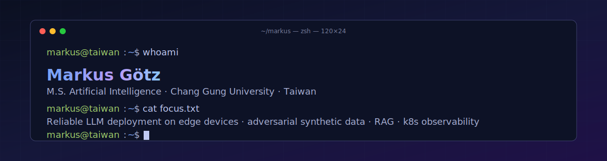
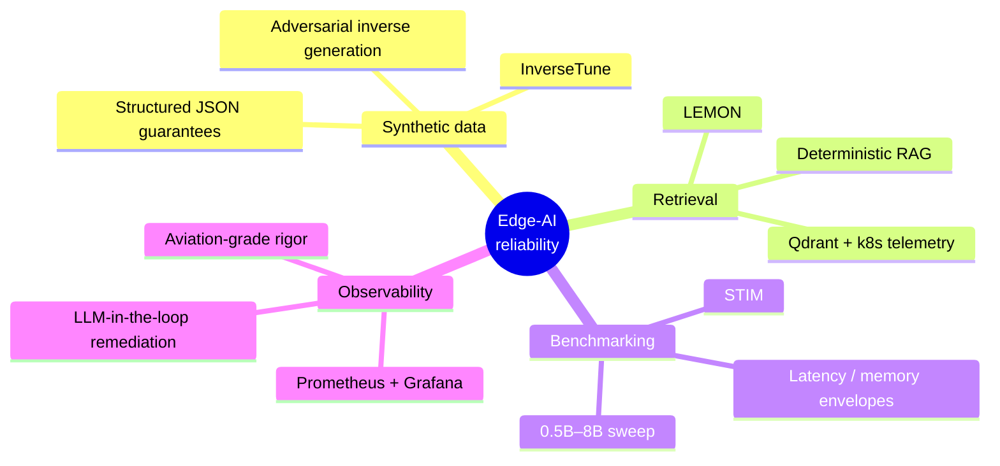

<!--
  Hi 👋 — this README is hand-written, but several blocks below are SVGs
  re-generated nightly by GitHub Actions in this repo:
    .github/workflows/metrics.yml   → metrics.svg
    .github/workflows/snake.yml     → output branch
  See the easter-egg 
 at the bottom for the why.
-->

<picture>
  <source media="(prefers-color-scheme: dark)" srcset="assets/header-dark.svg">
  <source media="(prefers-color-scheme: light)" srcset="assets/header-light.svg">
  
</picture>

  

  
  &nbsp;
  
  
  

---

## `> whoami`

I'm **Markus Götz** — a German engineer who fell hard for Taiwan during a 2023 exchange and stayed for an M.S. in Artificial Intelligence at **Chang Gung University** (GPA **4.0 / 4.0**, **Phi Tau Phi** honor society — top 3% of all M.S. students nationwide).

Before the AI pivot I spent **three years inside safety-critical aviation** at Frequentis Comsoft as part of a German dual-study program (B.S. Computer Science, GPA **4.0 / 4.0**) — Java, real-time ADS-B sensor fusion, the kind of code where "it works on my machine" is not a sentence anyone is allowed to say. That mindset is the lens I bring to AI work today: **deployment realism over benchmark theatre.**

My current research lives at the **edge-AI / LLM-reliability** intersection:

- **InverseTune** — adversarial inverse synthetic training for small (≤4B) language models. Beats Gemini 2.5 Flash by **+78.8 EM** on structured-output tasks. *Accepted, IEEE CCGrid 2026.*
- **LEMON** — LLM-driven microservices orchestration & monitoring. *Published, IEEE Transactions on Services Computing, 2026.* [`DOI 10.1109/TSC.2026.3679374`](https://doi.org/10.1109/TSC.2026.3679374)
- **STIM** — systematic SLM benchmarking on edge-class hardware. *Submitted, IEEE GLOBECOM 2026.*

I'm building a permanent career in **Taiwan** and looking for roles at the seam between research and shipped systems — edge inference, on-device LLMs, observability for ML, anything that demands both the paper and the post-mortem.

---

## 📚 Featured Research

<table>
  <tr>
    <td width="34%" align="center" valign="top">
      <h3>InverseTune</h3>
       
      
      
Adversarial inverse synthetic-data framework that fine-tunes &le;4B SLMs to emit reliable structured JSON on edge hardware — beating a much larger commercial cloud baseline.

    </td>
    <td width="33%" align="center" valign="top">
      <h3>LEMON</h3>
       
      
      
LLM-driven orchestration and deterministic-RAG monitoring layer for Kubernetes microservices, closing the loop between Prometheus telemetry and automated remediation.

    </td>
    <td width="33%" align="center" valign="top">
      <h3>STIM</h3>
      
      
Systematic Tuning &amp; Inference Metrics — benchmarking SLMs from 0.5B&nbsp;to&nbsp;8B under edge constraints: latency, memory, and structured-output stability.

    </td>
  </tr>
</table>

---

## 🛠 Featured Engineering

<table>
  <tr>
    <td width="34%" align="center" valign="top">
      <h3>LangFlow</h3>
        
      
Full-stack AI language-learning platform. React + TypeScript front, Node/Express + PostgreSQL back, fully dockerised. Dual LLM backends — local Ollama and hosted Groq — with runtime hot-swap.

    </td>
    <td width="33%" align="center" valign="top">
      <h3>Chinese Character Recognition</h3>
       
      
4,803-class handwritten-character benchmark across 11 architectures, with an ensemble ceiling of <strong>99.47%</strong> top-1 accuracy.

    </td>
    <td width="33%" align="center" valign="top">
      <h3>ADS-B Anomaly Detection</h3>
       
      
Real-time aviation-sensor anomaly pipeline in Java, validated against <strong>140k+</strong> live ADS-B messages during my time at Frequentis Comsoft.

    </td>
  </tr>
</table>

---

## 🧠 Research focus, in one diagram

---

## ⚙️ Tech I reach for

<table>
  <tr>
    <td><b>Languages</b></td>
    <td></td>
  </tr>
  <tr>
    <td><b>AI / ML</b></td>
    <td valign="middle">
      
      
      
      
    </td>
  </tr>
  <tr>
    <td><b>Backend</b></td>
    <td></td>
  </tr>
  <tr>
    <td><b>Infra</b></td>
    <td></td>
  </tr>
  <tr>
    <td><b>Frontend</b></td>
    <td></td>
  </tr>
</table>

---

## 📈 GitHub at a glance

  
  

  

  

---

## 🐍 Watching the snake eat the contribution graph

<picture>
  <source media="(prefers-color-scheme: dark)" srcset="https://raw.githubusercontent.com/XSnelliusX/XSnelliusX/output/github-snake-dark.svg">
  <source media="(prefers-color-scheme: light)" srcset="https://raw.githubusercontent.com/XSnelliusX/XSnelliusX/output/github-snake.svg">
  
</picture>

---

## 🔭 Live metrics — regenerated nightly

  

---

## 🚧 Currently

| Studying | Researching | Building |
|---|---|---|
| Mandarin (HSK 4 prep) | GRPO + DPO for SLM alignment | This README, recursively |
| Rust for safety-critical systems | Quantisation × structured-decoding interactions | A trilingual portfolio at [xsnelliusx.github.io](https://xsnelliusx.github.io) |

---

<b>🥚 Why this README has its own CI pipeline</b>

 

A profile README that never changes is a billboard. This one is a tiny living system.

- [`.github/workflows/metrics.yml`](.github/workflows/metrics.yml) runs `lowlighter/metrics` daily at 04:13 UTC, regenerates `metrics.svg`, and commits it back to `main`. Needs a `METRICS_TOKEN` repo secret — must be a **classic** PAT with `repo, read:user, read:org` scopes (the action does not yet support fine-grained tokens for the GraphQL API).
- [`.github/workflows/snake.yml`](.github/workflows/snake.yml) runs `Platane/snk` daily at 04:27 UTC and pushes the snake SVGs to a dedicated `output` branch — the README pulls them via `raw.githubusercontent.com`, so `main` stays clean.
- The header above is two hand-written SVGs (`assets/header-dark.svg`, `assets/header-light.svg`) swapped via `<picture>` + `prefers-color-scheme`. No external dependency, no rate limit.
- The `mindmap` is GitHub-native Mermaid — no image, just markdown. Try editing it.

If you ever wonder "is this README actually maintained?", check the commit log on `metrics.svg`. The bot is the answer.

<b>🇩🇪 Auf Deutsch · 🇹🇼 中文</b>

 

🇩🇪 &nbsp; Ich bin Markus, deutscher Ingenieur mit drei Jahren in sicherheitskritischer Luftfahrt‑Software (Java) und einem laufenden M.S. in Künstlicher Intelligenz an der Chang Gung University in Taiwan. Schwerpunkt: zuverlässiger LLM‑Einsatz auf Edge‑Geräten. Ich suche eine langfristige Position in Taiwan — gerne an der Schnittstelle zwischen Forschung und Produktion.

🇹🇼 &nbsp; 我是 Markus，德國工程師，目前於長庚大學人工智慧碩士班就讀（GPA 4.0／4.0，斐陶斐榮譽會員）。研究方向為小型語言模型在邊緣裝置上的可靠部署。希望長期留在台灣，尋找研究與工程兼具的職位。

---

  
    Built with <code>&lt;picture&gt;</code>, Mermaid, GitHub Actions, and a stubborn refusal to commit a static SVG. ·
    Last manual edit: <code>2026-04-22</code> ·
    The widgets refresh themselves.
  

