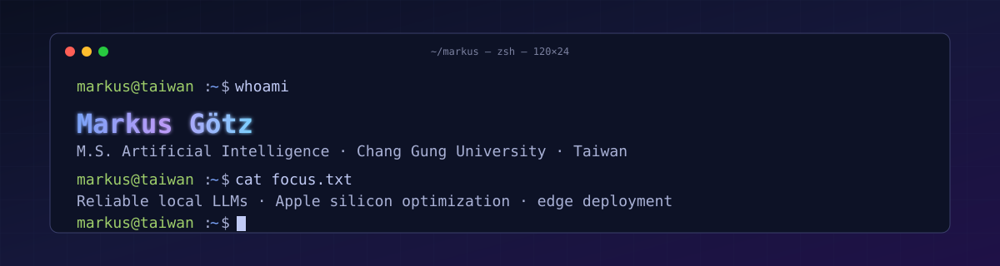

<picture>
  <source media="(prefers-color-scheme: dark)" srcset="assets/header-dark.svg">
  <source media="(prefers-color-scheme: light)" srcset="assets/header-light.svg">
  
</picture>

  <a href="https://xsnelliusx.github.io">Website</a> ·
  <a href="https://www.linkedin.com/in/markus-goetz-ai">LinkedIn</a>

## About me

I'm **Markus Götz**, a German software engineer and AI researcher based in Taiwan. I spent three years building software for aviation systems before studying artificial intelligence at Chang Gung University. My research focuses on making small language models reliable and practical for edge deployment.

I'm also exploring local model optimization on Apple silicon and learning **Go**.

## Publications

- **[LEMON: LLM-Enabled Monitoring for Microservices Orchestration](https://doi.org/10.1109/TSC.2026.3679374)** — *IEEE Transactions on Services Computing*, 2026. First author.
- **[InverseTune: Inverse Synthetic Fine-Tuning for Reliable Structured Output in Small Language Models](https://doi.org/10.1109/CCGrid68966.2026.00080)** — *IEEE CCGrid*, 2026. First author.
- **[LLM-NSMA: An Intelligent Monitoring and Analysis Framework for Kubernetes-Based Edge Network Services](https://doi.org/10.1109/ICCCI70321.2026.11666509)** — *IEEE ICCCI*, 2026. Co-author.
